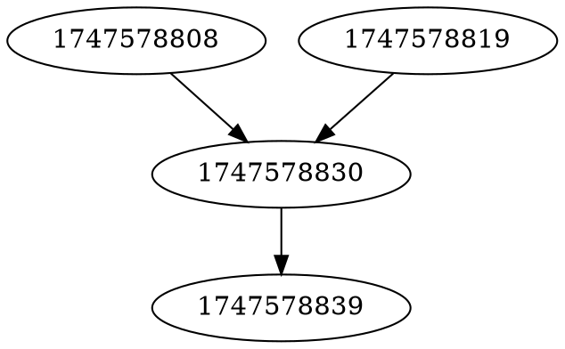

# Migration Graph Visualization

The `export` command allows you to visualize the directed acyclic graph (DAG) of your migrations. This is useful for understanding the dependency structure between migrations and sharing migration architecture with your team.

## Usage

```bash
kat export [OPTIONS]
```

The default export format is DOT, which can be visualized using tools like Graphviz:

```bash
# Export to DOT format and save to a file
kat export --file migrations.dot

# Generate an image using Graphviz (if installed)
dot -Tpng migrations.dot -o migrations.png
```

## Options

| Option           | Description                                                |
|------------------|------------------------------------------------------------|
| `--config`, `-c` | Path to the configuration file (default: `kat.conf.yaml`)  |
| `--file`, `-f`   | File to save graph to: `dot` or `json` (default: `stdout`) |

## Visualizing the Graph

The DOT format output can be visualized using various tools:

1. **Graphviz**: Install Graphviz and use the `dot` command line tool
2. **Online Visualizers**: Use online tools like [GraphvizOnline](https://dreampuf.github.io/GraphvizOnline/)

## Example

A typical migration graph might look like this in DOT format:



When visualized, this would show the dependency structure between these migrations.
