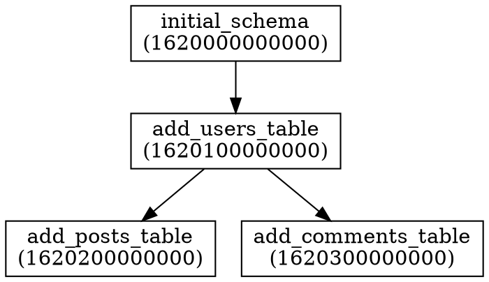

# Migration Graph

The `graph` command allows you to visualize the directed acyclic graph (DAG) of your migrations. This is useful for understanding the dependency structure between migrations.

## Usage

```bash
kat graph [OPTIONS]
```

## Export as DOT format

The default export format is DOT, which can be visualized using tools like Graphviz:

```bash
# Export to DOT format and save to a file
kat graph --format dot > migrations.dot

# Generate an image using Graphviz (if installed)
dot -Tpng migrations.dot -o migrations.png
```

## Export as JSON format

You can also export the migration graph as JSON for programmatic use:

```bash
kat graph --format json > migrations.json
```

## Options

| Option | Description |
|--------|-------------|
| `--config`, `-c` | Path to the configuration file (default: `kat.conf.yaml`) |
| `--format`, `-f` | Output format: `dot` or `json` (default: `dot`) |

## Visualizing the Graph

The DOT format output can be visualized using various tools:

1. **Graphviz**: Install Graphviz and use the `dot` command line tool
2. **Online Visualizers**: Use online tools like [GraphvizOnline](https://dreampuf.github.io/GraphvizOnline/)

## Example

A typical migration graph might look like this in DOT format:



When visualized, this would show the dependency structure between these migrations.
